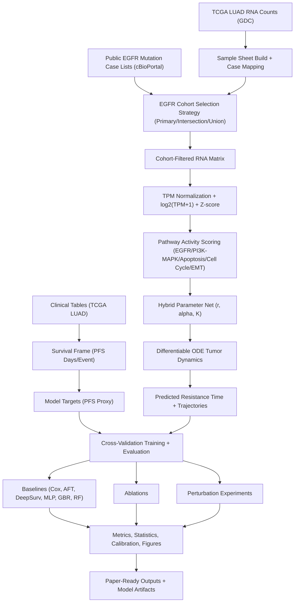
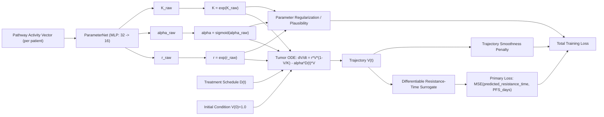

# Living Systems OS Research

This repository contains the research codebase for LS-OS work on executable hybrid tumor dynamics in EGFR-mutant NSCLC.

## Scope

The active research objective is to build and evaluate a hybrid mechanistic-learning model that maps:

- RNA-seq expression -> pathway activity
- Pathway activity -> ODE parameters (`r`, `alpha`, `K`)
- ODE simulation -> resistance timing / progression dynamics

Benchmarks include Cox and deep learning baselines with repeated stratified cross-validation, perturbation robustness, and ablations.

## Repository Structure

- `/Users/serverport/Living-Systems-OS/research-backend` : all research code, configs, scripts, and outputs
- `/Users/serverport/Living-Systems-OS/frontend` : landing page assets (not part of research pipeline)

## Research Stack (in `research-backend`)

- `src/lsos_research/` : core library modules
- `scripts/` : end-to-end execution scripts
- `configs/default.yaml` : experiment and cohort config
- `pathways/pathway_gene_sets.yaml` : pathway definitions
- `data/` : local data workspace (`raw`, `interim`, `processed`, `external`)
- `results/` : generated metrics, figures, tables, model artifacts
- `paper/` : generated result summaries and paper-facing artifacts

## Architecture And Flow



Complete run flow:
1. Build RNA sample sheet from downloaded GDC RNA files and map to case/sample IDs.
2. Extract and parse clinical tables to construct `pfs_days` and `pfs_event`.
3. Build EGFR-mutant cohort from public mutation case lists using configured strategy.
4. Filter RNA to primary tumor EGFR cohort and compute TPM/log/Z normalized matrix.
5. Convert gene-level expression into pathway activity features.
6. Train hybrid model (`pathway -> r, alpha, K -> ODE`) with repeated stratified CV.
7. Train all baselines on the same CV splits for fair comparison.
8. Run ablation suite and treatment perturbation simulations.
9. Save final metrics/tables/figures/model checkpoint and generate research summary report.

Model internals (hybrid executable core):



## Data Inputs

Primary inputs currently used:

- TCGA-LUAD RNA counts (local GDC download)
- TCGA-LUAD clinical tables
- Public EGFR-mutant case lists (cBioPortal-derived TSVs)

Notes:

- Controlled-access GDC mutation MAF is optional for v1 and not required for current public pipeline.
- Large datasets and generated artifacts are git-ignored.

## Environment Setup

```bash
cd /Users/serverport/Living-Systems-OS/research-backend
python -m venv .venv
source .venv/bin/activate
pip install -e .
```

## Run Order

From `/Users/serverport/Living-Systems-OS/research-backend`:

```bash
source .venv/bin/activate

python scripts/build_sample_sheet.py \
  --gdc-dir data/raw/gdc \
  --out data/interim/rna_sample_sheet.tsv \
  --mapped-out data/interim/rna_sample_sheet_mapped.tsv

python scripts/run_pipeline.py \
  --config configs/default.yaml \
  --root . \
  --sample-sheet data/interim/rna_sample_sheet_mapped.tsv

python scripts/build_report.py
```

## Main Outputs

- `results/metrics/fold_metrics.tsv`
- `results/metrics/statistical_tests.json`
- `results/metrics/perturbation_results.tsv`
- `results/tables/predictions_all.tsv`
- `results/tables/hybrid_parameters.tsv`
- `results/tables/egfr_source_concordance.tsv`
- `results/models/hybrid_final.pt`
- `results/figures/*.png`
- `paper/results_summary.md`

## Reproducibility

- Seed-controlled runs via config
- Repeated stratified CV and shared splits across models
- Deterministic preprocessing caches in `data/processed`
- Explicit config-driven cohort strategy and perturbation scenarios

## Current Limitations

- EGFR cohort labels are sourced from public mutation resources (no controlled GDC MAF in current path)
- Clinical endpoint proxies follow available TCGA progression/follow-up fields
- External validation cohorts are not yet mandatory in default run

## Research Goal

Demonstrate that executable hybrid dynamics models provide intervention-aware and biologically plausible prediction advantages over purely black-box baselines for EGFR-mutant NSCLC response modeling.
